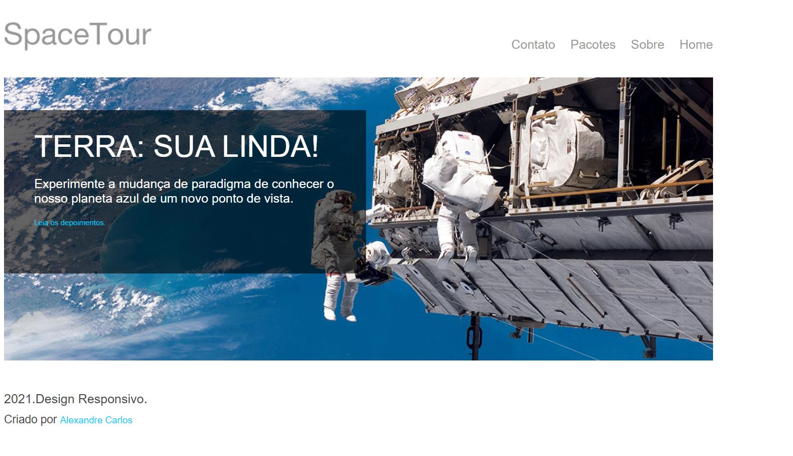

# SPACETUR
Checkpoint 3 da matéria de Responsive Web Development
## Regras
- O CP3 será realizado off-line, para entrega;
- A avaliação será realizada em grupo (obrigatório o grupo do challenge);
- Todos os integrantes devem contribuir;
- Não é permitido utilizar frameworks (frameworks são qualquer biblioteca adicionada ao projeto que agregue algum tipo de característica já pronta).  
Obs: Bibliotecas de ícones e fontes estão liberadas.
# Objetivo
- [ ] Criar um mini projeto sobre TURISMO ESPACIAL;
- [x] Criar um repositório no github de nome spacetur, adicioneum arquivo readme e coloque estas instruções no arquivo;
- [x] Clone o repositório;
- O projeto deve ser do tipo HTML5/CSS3/JAVASCRIPT;
- [x] Crie um arquivo index.html
- [x] Crie um arquivo css chamado style.css
- [x] Crie um arquivo js chamado script.js
- O projeto se baseia em uma página que trata de turismo espacial, bem no estilo Elon Musk de ser. As pessoas poderão viajar até o espaço e ter uma visão da terra;
- A página tem uma função de orientação e de captação de usuários, então além do visual agradável a página deve possuir um formulário para cadastrar usuários que estejam inclinados a realizar o tour;
- As informações que devem ser captadas são:
  - [ ] Nome e sobrenome
  - [ ] Email
  - [ ] CPF
  - [ ] Gênero
  - [ ] Data de nascimento
  - [ ] Campo mensagem com o rótulo "_Qual a sua motivação para a viagem?_";
  - [ ] O formulário não pode ser submetido com nenhum campo vazio;
  - [ ] Cada campo deve ser criado com seu tipo específico de dado;
  - [ ] Ao serem submetidas as informações, estando tudo ok, uma mensagem de alerta deve ser emitida informando que os dados foram cadastrados com sucesso e a navegação deve ser direcionada para a página inicial (isso é feito colocando a página de destino no action);
- [ ] O formulário deve ser acessado através de um item de menu chamado "_Contato_";
- [ ] O seu dever é criar a página e chegar em um resultado próximo ou igual ao da imagem abaixo:

- Todas as imagens serão disponibilizadas.
## Critérios
- (5 Pontos) Criação do projeto com arquivos;
- (15 Pontos) Aplicação de boas práticas (nomenclatura de arquivos, estrutura html e css, semântica);
- (25 Pontos) Estrutura HTML;
- (25 Pontos) Estilização CSS3;
- (30 Pontos) Controle com Javascript. 
## Estrutura
- Container: Definir uma `
` como container principal. Determine esse elemento como classe ou id de nome "_container_"(*) para esse elemento. Este deve conter todos os outros elementos;

- Layout: O layout deve ser dividido em 3 (três) áreas:
  - Cabeçalho (Determine a classe "_cabecalho_"(*) para o `<header>`);
  - Banner (Determine a classe "_banner_"(*) para o `<section>`);
  - Rodapé(Determine a classe "_rodape_"(*) para o `<footer>`).

- Cabeçalho: Deve ser adicionada uma imagem (logo-spacetours.png) e identificada com a classe "_logo_". Adicione um elemento semântico e identifique este com a classe de "_menu_", coloque uma lista com os seguintes itens dentro deste elemento:
  - Home
  - Sobre
  - Pacotes
  - Contato
 Cada item deve ser um hyperlink para (#).

- Banner: Neste elemento deve ser criada uma imagem (banner.jpg). Abaixo dessa imagem devemos criar uma `
` e identificar esta com a classe "_box_", ela deve conterum `<h1>`, um `
` e um `<a>`, respectivamente:
  - `<h1>` = "TERRA: SUA LINDA!"
  - `
`  = "Experimente a mudança de paradigma de conhecer o nosso planeta azul de um novo ponto de vista."
  - `<a>`  = "Leia depoimentos." (O hyperlink deve apontar para (#))

- Rodapé: Para o rodapé nós vamos ter um `
`, um `<small>` e um `<a>` com os respectivos textos onde o `<small>` deve ter a classe "_creditos_".
  `
` = "2021. Design Responsivo."
  A palavra "_Criado por SEU NOME_" deve estar entre uma `<small>` e o nome Alexandre Carlos deve estar entre um `<a>` onde o hyperlink deve apontar para (#).

## Apresentação
Todo o trabalho aqui deve ser realizado no arquivo de css externo style.css.
- [x] Faça o apontamento do arquivo css no HTML.

- Para o body determine os seguintes estilos:
  - [x] Tamanho do texto: 12px;
  - [x] Familia da fonte: Helvetica Neue, Helvetica, Arial ou sem serifa;
  - [x] Cor do texto #444.

- Para a classe container determine os seguintes estilos:
  - [x] Largura máxima: 1128px.

- Para todos os elementos `<a>` determine os seguintes estilos:
  - [x] Cor do texto #00ccff;
  - [x] Retire o estilo de hyperlink de todos os elementos;
  - [x] Tamanho do texto: 12px.

- Para todos os parágrafos determine os seguintes estilos:
  - [x] Tamanho do texto: 20px.

- Para todos os elementos `<a>` determine os seguintes estilos:
  - [x] Determine que ao passar o mouse os hyperlinks tenham sua decoração alterada para underline.

- Para todas as imagens determine os seguintes estilos:
  - [x] Largura máxima de 100%.

- Para a classe cabecalho determine os seguintes estilos:
  - [x] Largura: 100%;
  - [x] Altura: 48px;
  - [x] Margem do topo: 40px;
  - [x] Margem do rodapé: 40px.
 
- Para a classe logo determine os seguintes estilos:
  - [x] Faça o elemento flutuar para a esquerda.

- Para a classe menu determine os seguintes estilos:
  - [x] Faça o elemento flutuar para a direita.

- Para os items da lista determine os seguintes estilos:
  - [x] Faça com que a lista flutue para a direita;
  - [x] Coloque os itens em linha;
  - [x] Tamanho do texto: 14px;
  - [x] Margem esquerda: 24px;
  - [x] Margem topo 12px;
  - [x] Retire o estilo de lista.

- Para os hyperlinks dos itens da lista determine os seguintes estilos:
  - [x] Coloque a fonte do texto em 20px;
  - [x] Coloque a cor do texto como #999.

- Para a classe banner determine os seguintes estilos:
  - [x] Altura 450px;
  - [x] Margem rodapé 35px;
  - [x] Posição relativa.

- Para a classe caixa determine os seguintes estilos:
  - [x] Largura 42.5px;
  - [x] Preenchimento superior e inferior de 30px e direito e esquerdo de 48px;
  - [x] Posição absoluta;
  - [x] Posição top 48px;
  - [x] Fundo com cor rgba(0,0,0,0.5), utilize o sistema de cores numérico RGBA.

- Para os parágrafos descendentes de caixa determine os seguintes estilos:
  - [x] Tamanho do texto em 20px;
  - [x] Cor do texto #fff.

- Para o elemento `<h1>` determine os seguintes estilos:
  - [x] Margem topo 0;
  - [x] Margem rodapé 0;
  - [x] Tamanho do texto 48px;
  - [x] Espessura da fonte de 200;
  - [x] Cor do texto #fff.

- Para a classe rodape determine os seguintes estilos:
  - [x] Largura 100%;
  - [x] Margem rodapé 30px;
  - [x] Faça o elemento flutuar para a esquerda;
  - [x] Tamanho do texto em 30px.

- Para os parágrafos descendentes da classe rodape determine os seguintes estilos:
  - [x] Margem rodapé 0.

- Para os `<small>` descendentes da classe rodape determine os seguintes estilos:
  - [x] Tamanho do texto em 18px.
 
- Para os hyperlinks descendentes da classe footer determine os seguintes estilos:
  - [x] Tamanho do texto em 1

# Comportamento
- [ ] Todo o trabalho aqui deve ser realizado no arquivo de scripts externo script.js  
A função principal do Javascript é controlar o formulário, podendo se estender a outros comportamentos da página.  
Controlar o envio de dados do formulário, ou seja, quando usuário submeter os dados, realizar a verificação dos campos.  
OBS: Deve ser dada permissão ao usuário alecarlosjesus a esse repositório.
- [ ] Compactar o repositório do projeto juntamente com um arquivo .txt com o nome do grupo e nome de cada integrante e rm e submeter para o TEAMs.
